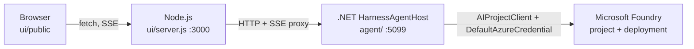

# Harness Agent Playground

A demo of the **Harness Agent** feature from the [Microsoft Agent Framework](https://learn.microsoft.com/en-us/agent-framework/concepts/harness), backed by a Microsoft Foundry deployment.

- **UI** — lightweight Node.js server + vanilla JS front-end (`ui/`).
- **Agent** — .NET 10 host that builds a `HarnessAgent` from `Microsoft.Agents.AI.Harness` and streams runs over SSE (`agent/`).
- **DB / state** — future SQLite / durable state lives in `data/`.

The Harness pre-configures **planning + todos**, per-service-call history persistence, compaction, tool auto-approval, web search (where the model supports it), and OpenTelemetry — you provide a chat client and custom tools.

## Folder layout

```text
harness-agent-playground/
├── agent/                  # ALL .NET code (Harness runtime + host)
│   ├── HarnessAgent.sln
│   └── HarnessAgentHost/
│       ├── HarnessAgentHost.csproj
│       ├── Program.cs
│       ├── appsettings.json
│       ├── Runtime/HarnessRuntime.cs
│       └── Tools/DemoTools.cs
├── ui/                     # ALL Node.js UI + wizard
│   ├── server.js           # HTTP + SSE proxy on :3000
│   ├── public/             # index.html, app.js, styles.css
│   └── setup/              # six-step wizard on :3100
├── data/                   # SQLite + local state
├── docs/
├── package.json
├── start.ps1
├── setup.ps1
└── README.md
```

## Prerequisites

- **Node.js 22.5+**
- **.NET 10 SDK** — the Agent Framework Harness NuGets target `net10.0`.
- **Azure CLI 2.x** (`az login` for Microsoft Entra ID auth — no keys anywhere in this demo)
- **PowerShell 7+** on Windows for the launcher
- A Microsoft Foundry account + project with a chat-capable deployment (e.g. `gpt-4o-mini`)

## Quick start

```powershell
cd C:\Users\vikaspandey\harness-agent-playground
.\start.ps1 -Setup
```

The wizard opens on `http://localhost:3100/`. Six steps:

1. **Prerequisites** — verify Node / .NET / Azure CLI / Python / Git.
2. **Sign in** — `az login`.
3. **Subscription** — pick from a dropdown.
4. **Resource group + Foundry account** — reuse or create. The wizard creates a `default-project`, assigns `Cognitive Services User`, `Cognitive Services OpenAI User`, `Azure AI User`, and `Azure AI Project Manager` on your signed-in user.
5. **Deployment** — pick or create the chat deployment the harness should call.
6. **Launch** — writes `.env`, boots the .NET agent host, then the Node UI on port 3000.

Once launched, chat with the harness at `http://localhost:3000/`.

## Environment variables (`.env`)

The wizard writes these; you can also set them manually.

| Key                            | Consumed by | Example                                                                 |
| ------------------------------ | ----------- | ----------------------------------------------------------------------- |
| `FOUNDRY_PROJECT_ENDPOINT`     | .NET host   | `https://my-foundry.services.ai.azure.com/api/projects/default-project` |
| `FOUNDRY_MODEL`                | .NET host   | `gpt-4o-mini`                                                           |
| `HARNESS_PORT`                 | both        | `5099`                                                                  |
| `PORT`                         | Node UI     | `3000`                                                                  |
| `AZURE_FOUNDRY_RESOURCE_NAME`  | Node UI     | `my-foundry`                                                            |
| `AZURE_FOUNDRY_RESOURCE_GROUP` | Node UI     | `rg-harness-demo`                                                       |

## How it works



Each `POST /api/agent/run` streams SSE events straight from the .NET host through Node to the browser:

- `start` — echoed prompt + current mode
- `text` — streamed model tokens
- `tool_call` / `tool_result` — every function invocation (`todos_add`, `mode_set`, `get_time`, …)
- `usage` — token counters per turn
- `done` — final status snapshot (mode + todo list)

## Try it

Open `http://localhost:3000/` and paste:

> Plan a lightning talk on the Agent Framework Harness, then execute it.

The agent (in **plan** mode) creates todos via `todos_add`, asks for approval, then switches to **execute** mode via `mode_set` and works through the list.

Force execute mode from the app side by clicking the **execute** button under the composer — this calls `AgentModeProvider.SetModeAsync` on the server, which injects a mode-change notification on the next run.

## References

- [Agent Harness | Microsoft Learn](https://learn.microsoft.com/en-us/agent-framework/concepts/harness?pivots=programming-language-csharp)
- [Planning and Todos | Microsoft Learn](https://learn.microsoft.com/en-us/agent-framework/agents/planning-and-todos?pivots=programming-language-csharp)
- [.NET Harness samples on GitHub](https://github.com/microsoft/agent-framework/tree/main/dotnet/samples/02-agents/Harness)
- [`Microsoft.Agents.AI.Harness` source](https://github.com/microsoft/agent-framework/tree/main/dotnet/src/Microsoft.Agents.AI/Harness)
